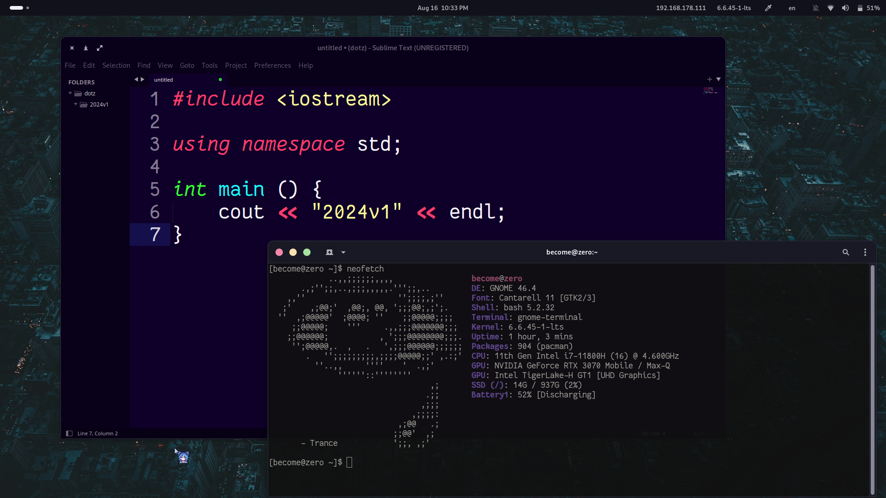

# dotz
## My archive config system. 

> [!CAUTION]
> Please always indicate where you got the configuration when re-uploading

  
 

  
 20241 Configurations

  

  	
Gnome Extensions

  	<a href="https://extensions.gnome.org/extension/5446/quick-settings-tweaker/">[QSTweak] Quick Setting Tweaker</a> 
  	<a href="https://extensions.gnome.org/extension/4679/burn-my-windows/">Burn My Windows</a> 
  	<a href="https://extensions.gnome.org/extension/517/caffeine/">Caffeine</a> 
  	<a href="https://extensions.gnome.org/extension/3396/color-picker/">Color Picker</a> 
  	<a href="https://extensions.gnome.org/extension/6880/kernel-indicator/">Kernel Indicator</a> 
  	<a href="https://extensions.gnome.org/extension/1762/lan-ip-address/">LAN IP Address</a> 
  	<a href="https://extensions.gnome.org/extension/5856/overview-background/">Overview Background</a> 
  	<a href="https://extensions.gnome.org/extension/4491/privacy-settings-menu/">Privacy Quick Settings</a> 
  	<a href="https://extensions.gnome.org/extension/4559/quick-lang-switch/">Quick Lang Switch</a> 
  	<a href="https://extensions.gnome.org/extension/1414/unblank/">Unblank lock screen</a> 
  	<a href="https://extensions.gnome.org/extension/19/user-themes/">User Themes</a> 
  	<a href="https://extensions.gnome.org/extension/5416/wifi-qrcode/">Wifi QR Code</a> 
  

  

  	
Icons

  	<a href="https://drasite.com/flat-remix">Flat Remix ICON Theme</a> 
  	<a href="https://www.gnome-look.org/p/2165826">Bbarto Cursor</a> 
  

  

  	
Themes

  	<a href="https://github.com/catppuccin/gtk">Catppuccin GTK</a> 
  

  

  	
Fonts

  	<a href="https://github.com/belluzj/fantasque-sans">Fantasque-Sans</a> 
  

